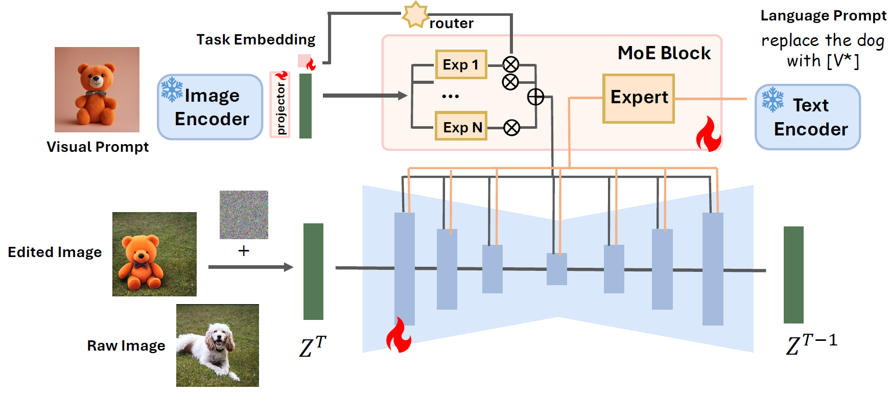

# AnyBench and AnySD

[](https://arxiv.org/abs/2411.15738)
[](https://huggingface.co/datasets/Bin1117/AnyEdit)
[](https://huggingface.co/WeiChow/AnySD)
[](https://github.com/DCDmllm/AnyEdit)
[](https://dcd-anyedit.github.io/)


> This is the official model implementation and benchmark evaluation repository of 
> **AnyEdit: Unified High-Quality Image Edit with Any Idea**

## **🚀** Quick Start

1. **Clone this repo**

```shell
git clone https://github.com/weichow23/AnySD
```


2. **Environment setup**
```bash
conda create -n anyedit python=3.9.2
conda activate anyedit
pip install -r requirements.txt
pip install --upgrade torch diffusers xformers triton pydantic deepspeed
pip install git+https://github.com/openai/CLIP torchmetrics==0.5
```

3. For AnyBench you need to
```shell
bash anybench/setup.sh  # You need to go into the script and carefully check to ensure that the correct dependencies are installed.
```

## 📊 AnyBench

This is the guide for the evaluation tool for AnyBench. The specific files are located in the `anybench` directory.

We have integrated the evaluations for `AnyBench`, `Emu-edit`, and `MagicBrush` into the same codebase, and it supports the following models: `Null-Text`, `Uni-ControlNet`, `InstructPix2Pix`, `MagicBrush`, `HIVE`, and `UltraEdit (SD3)`.

Evaluation metrics are `CLIPim↑`, ` CLIPout↑`, ` L1↓` ,` L2↓`and  `DINO↑`

#### 🏆 Evaluation

**EMU-Edit**

```shell
CUDA_VISIBLE_DEVICES=7 PYTHONPATH='./' python3 anybench/eval/emu_gen_eval.py
```
It is worth noting that the emu-edit test actually uses the validation set from the Hugging Face repository [facebook/emu_edit_test_set_generations](https://huggingface.co/datasets/facebook/emu_edit_test_set_generations). This point has been discussed in previous work [here](https://github.com/HaozheZhao/UltraEdit/issues/18).

**MagicBrush**

download the test set from [MagicBrush](https://osu-nlp-group.github.io/MagicBrush/) and unzip it in `anybench/dataset/magicbrush`

```shell
CUDA_VISIBLE_DEVICES=7 PYTHONPATH='./' python3 anybench/eval/magicbrush_gen_eval.py
```

**AnyBench**

1. download the [AnyBench-test](https://drive.usercontent.google.com/download?id=1V-Z4agWoTMzAYkRJQ1BNz0-i79eAVWt4&export=download&authuser=0)

```shell
cd anybench/dataset/
gdown 1V-Z4agWoTMzAYkRJQ1BNz0-i79eAVWt4
sudo apt install unzip
unzip AnyEdit-Test.zip 
```

```shell
CUDA_VISIBLE_DEVICES=0 PYTHONPATH='./' python3 anybench/eval/anybench_gen_eval.py
```

⚠ Notice: AnySD may output completely black images for certain sensitive commands, which is a normal occurrence.

⚠ Notice: During evaluation, the final scores may vary due to the influence of inference hyperparameters, random seeds, and batch size.

## 🎨 AnySD

#### 🌐 Inference

We sorted out the AnyEdit data when we released it to the public. To adapt the sorted model, we retrained the model, so the results will be slightly different from those in the paper, but the general results are similar. And the hyperparameters also have a greater impact on the results.

```shell
CUDA_VISIBLE_DEVICES=0 PYTHONPATH='./' python3 anysd/infer.py
```

#### 🔮 Training

**Prepare Data**

```shell
huggingface-cli download Bin1117/anyedit-split --repo-type dataset
```

1. **Stage I**
```shell
bash train_stage1.sh
```
2. **Stage II**
```shell
# before training, you should download anybench-test as it is the validation set
cd anybench/dataset/
gdown 1w_QsjDvNp-c9R1gaT5lex0esQAPRE1AQ
sudo apt install unzip
unzip AnyEdit-Test.zip 
```

The experts included in AnySD are as follows

```shell
# TYPE = ['visual_ref', 'visual_ske', 'visual_scr', 'visual_bbox', 'visual_mat', 'visual_seg', 'visual_dep', 'viewpoint', 'global']
bash train_stage2.sh
```


#### 🔎 Summary

Since  **AnyEdit** contains a wide range of editing instructions across various domains, it holds promising potential for developing a powerful editing model to address high-quality editing tasks. However, training such a model has three extra challenges: (a) aligning the semantics of various multi-modal inputs; (b) identifying the semantic edits within each domain to control the granularity and scope of the edits; (c) coordinating the complexity of various editing tasks to prevent catastrophic forgetting. To this end, we propose a novel **AnyEdit Stable Diffusion** approach (🎨**AnySD**) to cope with various editing tasks in the real world.



**Architecture of 🎨AnySD**. 🎨**AnySD** is a novel architecture that supports three conditions (original image, editing instruction, visual prompt) for various editing tasks.

💖 Our model is based on the awesome **[SD 1.5 ](https://huggingface.co/stable-diffusion-v1-5/stable-diffusion-v1-5)**

## 📚 Citation

```shell
@article{yu2024anyedit,
  title={AnyEdit: Mastering Unified High-Quality Image Editing for Any Idea},
  author={Yu, Qifan and Chow, Wei and Yue, Zhongqi and Pan, Kaihang and Wu, Yang and Wan, Xiaoyang and Li, Juncheng and Tang, Siliang and Zhang, Hanwang and Zhuang, Yueting},
  journal={arXiv preprint arXiv:2411.15738},
  year={2024}
}
```
